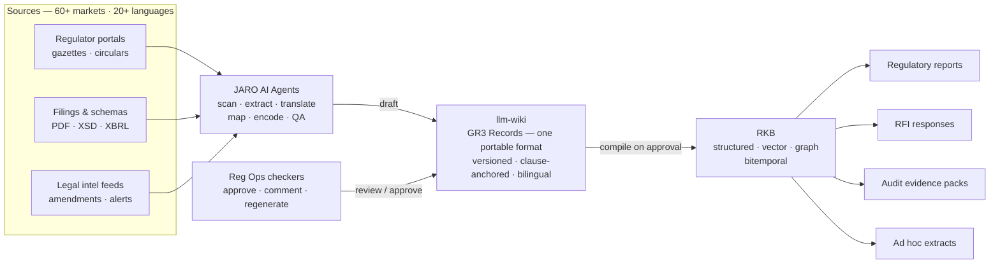
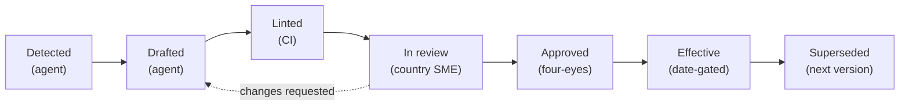
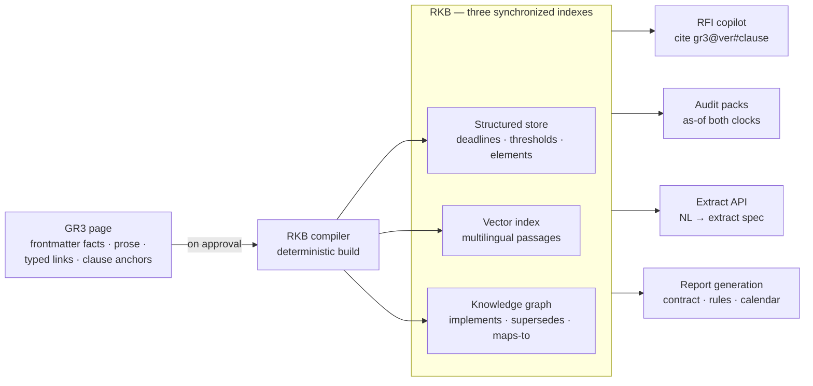
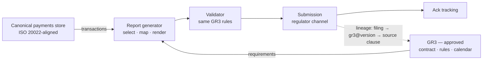

# GR3 — Global Regulatory Requirement Record

**One portable, open format for every payments-reporting obligation, in every jurisdiction.**

GR3 is the core format of **Agentic Reg Ops**: every regulatory reporting requirement — a Bundesbank Z4 circular in German, a SAFE BOP measure in Chinese, a BCRA FX regime in Spanish — becomes one Markdown + YAML record that humans read as a governed document and AI agents parse as structured data. GR3 builds on **RegGPT** — the Agentic Reg Ops product, supported by **JARO AI Agents** and the **RKB** (Regulatory Knowledge Base).

## Executive summary

### The problem

A global payments business files regulatory returns in every market it operates in — transaction reports, balance-of-payments statistics, central-bank returns, AML filings. Each obligation arrives as a circular, gazette notice, portal announcement, or schema release, written in the regulator's language and amended continually. The data side of this problem is largely solved: payments already flow through canonical stores.

The unsolved side is the **interpretation layer** — what each regulator actually requires, which transactions are in scope, what the thresholds and deadlines are, how local terms map to the bank's data elements. Today that layer lives in country spreadsheets, email threads, and the heads of long-tenured Reg Ops staff. Every regulatory report, RFI, audit, and ad hoc extract re-derives it from scratch, and no two derivations agree.

### The thesis

Make the interpretation layer itself a governed, versioned corpus. Every obligation becomes one **GR3 Record** — a single portable document that Reg Ops sees and edits and AI agents read and interpret, one shared surface with no divergence between the human version and the machine version — living in an **llm-wiki** organized by region and country. JARO AI Agents draft; Reg Ops checkers approve everything; the RKB compiles what passes the gate and serves it with exact citations, so every figure in every filing traces to a clause.

### The solution



1. **Maker — JARO AI Agents.** Scan regulators, extract requirements from the original language, translate (segment-aligned, originals immutable), map data elements to an ISO 20022-keyed dictionary, and encode machine-evaluable rule twins. Every drafted fact must cite an anchored clause or CI rejects it.
2. **Checker — Reg Ops.** Country SMEs review each draft (diff + anchored clauses + CI results) and approve or request changes; a four-eyes approver co-signs anything entering effect. Agents cannot approve, merge, or file — enforced by runtime policy.
3. **Regenerate on feedback.** Checker comments become instructions: JARO regenerates reg reports, RFI responses, audit packs, or extracts with the feedback applied — back through the same review gate.
4. **Serve from the RKB.** Approved records compile into three synchronized indexes; retrieval is citation-mandatory (`gr3@version#clause`) and bitemporal (`as_of_effective`, `as_of_knowledge`).

Every record moves through an explicit lifecycle — agents own the left of the pipeline, humans own the gate, the calendar owns activation:



> **Fail-closed:** the RKB serves, and filings use, only versions that are **Approved and Effective**. Draft and in-review states are invisible downstream.

On every approval, a deterministic compiler fans the record into the RKB's three indexes — no guessed chunking, because the input is structured:



The same records that answer questions also generate the reports — generator and validator read the same GR3, so a filing cannot satisfy a different interpretation than the one Reg Ops approved:



## Built on open patterns

- **The [LLM-Wiki pattern](https://gist.github.com/karpathy/442a6bf555914893e9891c11519de94f)** (Karpathy) — a persistent, compounding wiki of interlinked Markdown maintained by agents, instead of per-query retrieval from raw documents. Layers: immutable sources → curated wiki → schema; verbs: ingest, query, lint. Agents do the bookkeeping; humans do the curation.
- **[Google's Open Knowledge Format (OKF)](https://cloud.google.com/blog/products/data-analytics/how-the-open-knowledge-format-can-improve-data-sharing)** — Markdown + YAML frontmatter knowledge bases with exactly one mandatory field (`type`), vendor-neutral, no proprietary SDK. Every GR3 page declares `type: gr3.record` / `gr3.source` / `gr3.element` / `gr3.note`, so any OKF consumer can ingest the corpus without custom parsing.

What GR3 adds on top of both:

1. **A portable document with two live readers.** Reg Ops sees and edits the same page that AI agents read and interpret — one shared surface, no export step, no divergence between the human version and the machine version.
2. **The governance half** that regulated filings demand — maker-checker lifecycle, four-eyes approval, clause-level anchoring to original-language sources, bitemporal clocks (`effective_from` + `knowledge_from`), and fail-closed serving (only approved + effective versions are ever served or filed).

## Repository map

| Path | What it is |
|---|---|
| [`docs/the-gr3-standard.html`](docs/the-gr3-standard.html) | **The GR3 Standard** — the white paper: format, open-pattern lineage, worked gallery across EMEA/APAC/LATAM, RegGPT integration path, build plan |
| [`docs/system-design.html`](docs/system-design.html) | **Agentic Reg Ops** — the full system design: llm-wiki architecture, record lifecycle, JARO AI Agents & the human loop, RKB compilation, report-generation runtime, change management |
| [`prototype/llm-wiki.html`](prototype/llm-wiki.html) | **Interactive llm-wiki prototype** — 19 jurisdictions, GR3 Records in human/agent views, checker workbench with approve / feedback / JARO regeneration (self-contained; open in a browser) |
| [`spec/gr3.de.bbk.awv-z4.md`](spec/gr3.de.bbk.awv-z4.md) | The first **GR3 Record** in this repo, in the portable format itself — Germany, Bundesbank AWV Z4 (illustrative) |

The living, shareable versions of the documents are published as Claude artifacts:
[white paper](https://claude.ai/code/artifact/ba747873-96ae-4055-a74e-8fa7145b1255) ·
[system design](https://claude.ai/code/artifact/40348ebb-09eb-4cc1-a672-2ad753e98a33) ·
[llm-wiki prototype](https://claude.ai/code/artifact/503997ee-4922-4afa-9ec7-87c8bfc8605d)

## The format at a glance

```yaml
---
gr3: gr3:de.bbk.awv-z4@4.2.0          # jurisdiction.regulator.report @ semver
type: gr3.record                      # OKF: the one mandatory field
legal_basis:
  - cite: AWV §67(1)
    source: src/de/awv-2024.de.pdf#sec-67   # original language, clause-anchored
obligation:
  trigger:
    prose: >                          # plane 1 — for humans and RFIs
      Cross-border payments above EUR 12,500 …
    rule: |                           # plane 2 — machine-evaluable twin
      amount_eur > 12500 and counterparty.country != "DE"
lifecycle:
  status: effective                   # fail-closed: drafts are invisible downstream
  effective_from: 2025-01-01          # clock 1 — when the obligation applies
  knowledge_from: 2024-11-18          # clock 2 — when we approved the interpretation
---
```

## Status

Concept and design stage (August 2026). All regulatory content in this repository is **illustrative and abbreviated — not legal guidance**.
